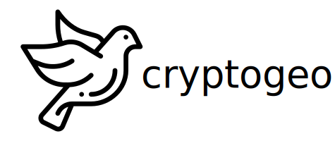
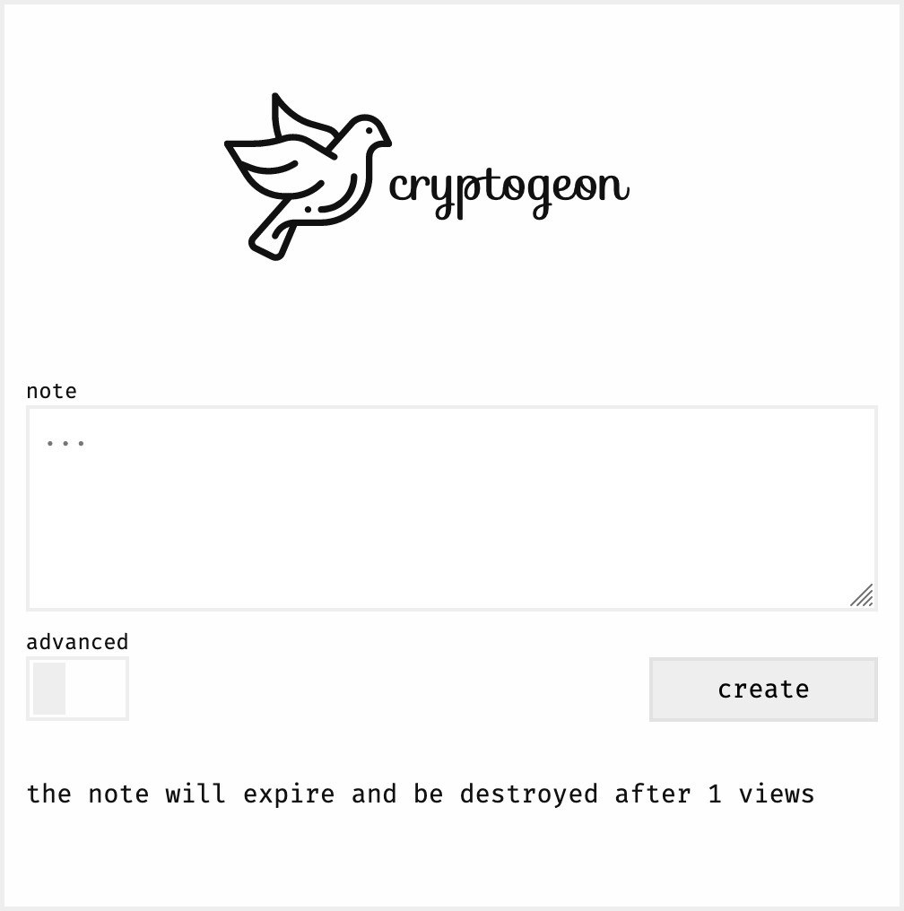

<p align="center">

</p>

## About?

_cryptgeon_ is an secure, open source sharing note service inspired by [_PrivNote_](https://privnote.com)

## Features

- view and time constrains
- in memory, no persistence
- in browser encryption → server cannot decrypt contents

## How does it work?

each note has a 512bit generated <i>id</i> that is used to retrieve the note. data is stored in memory and never persisted to disk.

## Screenshot



## Deployment

Docker is the easiest way.

```yaml
# docker-compose.yml

version: '3.7'

services:
  memcached:
    image: memcached:1-alpine
    entrypoint: memcached -m 128 # Limit to 128 MB Ram, customize at free will.

  app:
    image: cupcakearmy/cryptgeon:latest
    ports:
      - 80:5000
```

###### Attributions

Icons made by <a href="https://www.freepik.com" title="Freepik">freepik</a> from <a href="https://www.flaticon.com/" title="Flaticon">www.flaticon.com</a>
