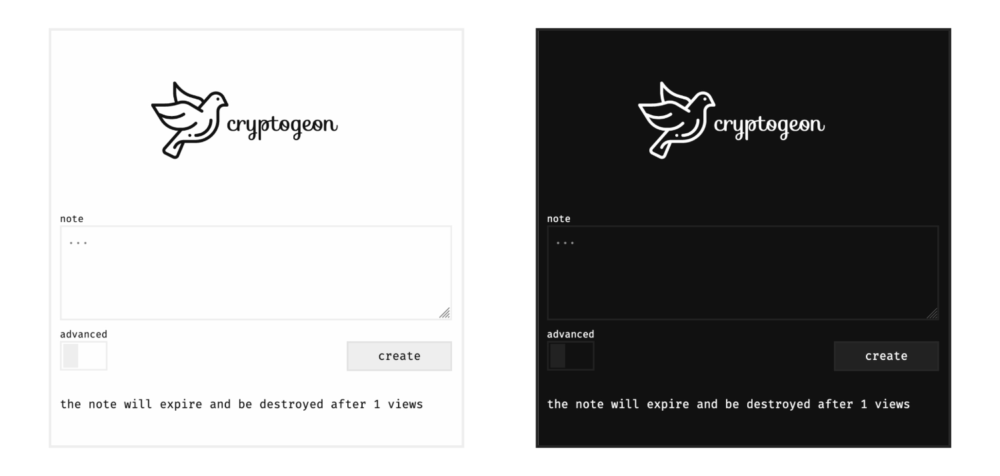

<p align="center">
  
</p>

<a href="https://discord.gg/nuby6RnxZt">
  
  
  
  
</a>

<br/>
<a href="https://www.producthunt.com/posts/cryptgeon?utm_source=badge-featured&utm_medium=badge&utm_souce=badge-cryptgeon" target="_blank"></a>
<a href="">
<br/>

EN | [简体中文](README_zh-CN.md)

## About?

_cryptgeon_ is a secure, open source sharing note or file service inspired by [_PrivNote_](https://privnote.com)

> 🌍 If you want to translate the project feel free to reach out to me.
>
> Thanks to [Lokalise](https://lokalise.com/) for providing free access to their platform.

## Demo

Check out the demo and see for yourself https://cryptgeon.nicco.io.

## Features

- server cannot decrypt contents due to client side encryption
- view or time constraints
- in memory, no persistence
- obligatory dark mode support

## How does it work?

each note has a generated <code>id (256bit)</code> and <code>key 256(bit)</code>. The
<code>id</code>
is used to save & retrieve the note. the note is then encrypted with aes in gcm mode on the
client side with the <code>key</code> and then sent to the server. data is stored in memory and
never persisted to disk. the server never sees the encryption key and cannot decrypt the contents
of the notes even if it tried to.

## Screenshot



## Environment Variables

| Variable         | Default           | Description                                                                             |
| ---------------- | ----------------- | --------------------------------------------------------------------------------------- |
| `MEMCACHE`       | `memcached:11211` | Memcached URL to connect to.                                                            |
| `SIZE_LIMIT`     | `1 KiB`           | Max size for body. Accepted values according to [byte-unit](https://docs.rs/byte-unit/) |
| `MAX_VIEWS`      | `100`             | Maximal number of views.                                                                |
| `MAX_EXPIRATION` | `360`             | Maximal expiration in minutes.                                                          |
| `ALLOW_ADVANCED` | `true`            | Allow custom configuration. If set to `false` all notes will be one view only.          |

## Deployment

ℹ️ `https` is required otherwise browsers will not support the cryptographic functions.

### Docker

Docker is the easiest way. There is the [official image here](https://hub.docker.com/r/cupcakearmy/cryptgeon).

```yaml
# docker-compose.yml

version: '3.7'

services:
  memcached:
    image: memcached:1-alpine
    entrypoint: memcached -m 128M -I 4M # Limit to 128 MB Ram, 4M per entry, customize at free will.

  app:
    image: cupcakearmy/cryptgeon:latest
    depends_on:
      - memcached
    environment:
      SIZE_LIMIT: 4M
    ports:
      - 80:5000
```

### NGINX Proxy

See the [examples/nginx](https://github.com/cupcakearmy/cryptgeon/tree/main/examples/nginx) folder. There an example with a simple proxy, and one with https. You need to specify the server names and certificates.

### Traefik 2

Assumptions:

- External proxy docker network `proxy`
- A certificate resolver `le`
- A https entrypoint `secure`
- Domain name `example.org`

```yaml
version: '3.8'

networks:
  proxy:
    external: true

services:
  memcached:
    image: memcached:1-alpine
    restart: unless-stopped
    entrypoint: memcached -m 128M -I 4M # Limit to 128 MB Ram, 4M per entry, customize at free will.

  app:
    image: cupcakearmy/cryptgeon:latest
    restart: unless-stopped
    depends_on:
      - memcached
    networks:
      - default
      - proxy
    labels:
      - traefik.enable=true
      - traefik.http.routers.cryptgeon.rule=Host(`example.org`)
      - traefik.http.routers.cryptgeon.entrypoints=secure
      - traefik.http.routers.cryptgeon.tls.certresolver=le
```

## Development

**Requirements**

- `pnpm`: `>=6`
- `node`: `>=14`
- `rust`: edition `2021`

**Install**

```bash
pnpm install
pnpm --prefix frontend install

# Also you need cargo watch if you don't already have it installed.
# https://lib.rs/crates/cargo-watch
cargo install cargo-watch
```

**Run**

Make sure you have docker running.

> If you are on `macOS` you might need to disable AirPlay Receiver as it uses port 5000 (So stupid...)
> https://developer.apple.com/forums/thread/682332

```bash
pnpm run dev
```

Running `pnpm run dev` in the root folder will start the following things:

- a memcache docker container
- rust backend with hot reload
- client with hot reload

You can see the app under [localhost:1234](http://localhost:1234).

###### Attributions

Icons made by <a href="https://www.freepik.com" title="Freepik">freepik</a> from <a href="https://www.flaticon.com/" title="Flaticon">www.flaticon.com</a>
