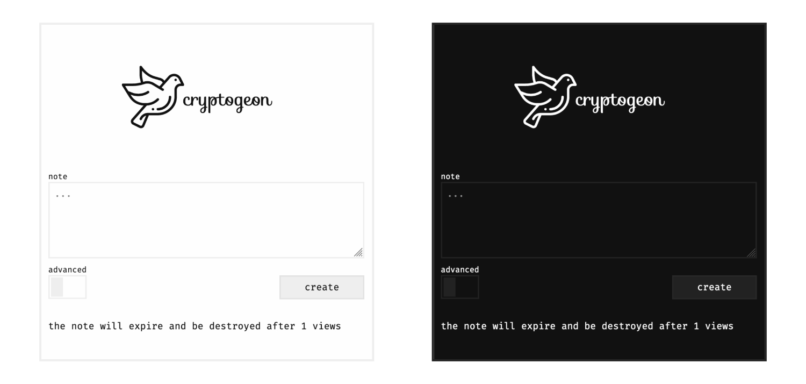

<p align="center">
  
</p>

<a href="https://discord.gg/nuby6RnxZt">
  
  
  
  
</a>

<br/><br/>
<a href="https://www.producthunt.com/posts/cryptgeon?utm_source=badge-featured&utm_medium=badge&utm_souce=badge-cryptgeon" target="_blank"></a>
<a href="">
<br/><br/>

[EN](README.md) | [简体中文](README_zh-CN.md) | ES

## Acerca de

_cryptgeon_ es un servicio seguro y de código abierto para compartir notas o archivos inspirado en [_PrivNote_](https://privnote.com).
Incluye un servidor, una página web y una interfaz de línea de comandos (CLI, por sus siglas en inglés).

> 🌍 Si quieres traducir este proyecto no dudes en ponerte en contacto conmigo.
>
> Gracias a [Lokalise](https://lokalise.com/) por darnos acceso gratis a su plataforma.

## Demo

### Web

Prueba la demo y experimenta por ti mismo [cryptgeon.org](https://cryptgeon.org)

### CLI

```
npx cryptgeon send text "Esto es una nota secreta"
```

Puedes revisar la documentación sobre el CLI en este [readme](./packages/cli/README.md).

## Características

- enviar texto o archivos
- el servidor no puede desencriptar el contenido debido a que la encriptación se hace del lado del cliente
- restricción de vistas o de tiempo
- en memoria, sin persistencia
- compatibilidad obligatoria con el modo oscuro

## ¿Cómo funciona?

Se genera una <code>id (256bit)</code> y una <code>llave 256(bit)</code> para cada nota. La
<code>id</code>
se usa para guardar y recuperar la nota. Después la nota es encriptada con la <code>llave</code> y con aes en modo gcm del lado del cliente y por último se envía al servidor. La información es almacenada en memoria y nunca persiste en el disco. El servidor nunca ve la llave de encriptación por lo que no puede desencriptar el contenido de las notas aunque lo intentara.

## Capturas de pantalla



## Variables de entorno

| Variable           | Default          | Descripción                                                                                                                                                                                                         |
| ------------------ | ---------------- | ------------------------------------------------------------------------------------------------------------------------------------------------------------------------------------------------------------------- |
| `REDIS`            | `redis://redis/` | Redis URL a la que conectarse. [Según el formato](https://docs.rs/redis/latest/redis/#connection-parameters)                                                                                                        |
| `SIZE_LIMIT`       | `1 KiB`          | Tamaño máximo. Valores aceptados según la [unidad byte](https://docs.rs/byte-unit/). <br> `512 MiB` es el máximo permitido. <br> El frontend mostrará ese número, incluyendo el ~35% de sobrecarga de codificación. |
| `MAX_VIEWS`        | `100`            | Número máximo de vistas.                                                                                                                                                                                            |
| `MAX_EXPIRATION`   | `360`            | Tiempo máximo de expiración en minutos.                                                                                                                                                                             |
| `ALLOW_ADVANCED`   | `true`           | Permitir configuración personalizada. Si se establece en `false` todas las notas serán de una sola vista.                                                                                                           |
| `ID_LENGTH`        | `32`             | Establece el tamaño en bytes de la `id` de la nota. Por defecto es de `32` bytes. Esto es útil para reducir el tamaño del link. _Esta configuración no afecta el nivel de encriptación_.                            |
| `VERBOSITY`        | `warn`           | Nivel de verbosidad del backend. [Posibles valores](https://docs.rs/env_logger/latest/env_logger/#enabling-logging): `error`, `warn`, `info`, `debug`, `trace`                                                      |
| `THEME_IMAGE`      | `""`             | Imagen personalizada para reemplazar el logo. Debe ser accesible públicamente.                                                                                                                                      |
| `THEME_TEXT`       | `""`             | Texto personalizado para reemplazar la descripción bajo el logo.                                                                                                                                                    |
| `THEME_PAGE_TITLE` | `""`             | Texto personalizado para el título                                                                                                                                                                                  |
| `THEME_FAVICON`    | `""`             | Url personalizada para el favicon. Debe ser accesible públicamente.                                                                                                                                                 |
| `THEME_HOME_LINK`  | `true`           | Mostrar el enlace `/home` en el pie de página. El valor predeterminado es `true`.                                                                                                                               |

## Despliegue

> ℹ️ Se requiere `https` de lo contrario el navegador no soportará las funciones de encriptación.

> ℹ️ Hay un endpoint para verificar el estado, lo encontramos en `/api/health/`. Regresa un código 200 o 503.

### Docker

Docker es la manera más fácil. Aquí encontramos [la imagen oficial](https://hub.docker.com/r/cupcakearmy/cryptgeon).

```yaml
# docker-compose.yml

version: "3.8"

services:
  redis:
    image: redis:7-alpine
    # This is required to stay in RAM only.
    command: redis-server --save "" --appendonly no
    # Set a size limit. See link below on how to customise.
    # https://redis.io/docs/latest/operate/rs/databases/memory-performance/eviction-policy/
    # --maxmemory 1gb --maxmemory-policy allkeys-lrulpine
    # This prevents the creation of an anonymous volume.
    tmpfs:
      - /data

  app:
    image: cupcakearmy/cryptgeon:latest
    depends_on:
      - redis
    environment:
      # Size limit for a single note.
      SIZE_LIMIT: 4 MiB
    ports:
      - 80:8000

    # Optional health checks
    # healthcheck:
    #   test: ["CMD", "curl", "--fail", "http://127.0.0.1:8000/api/live/"]
    #   interval: 1m
    #   timeout: 3s
    #   retries: 2
    #   start_period: 5s
```

### NGINX Proxy

Ver la carpeta de [ejemplo/nginx](https://github.com/cupcakearmy/cryptgeon/tree/main/examples/nginx). Hay un ejemplo con un proxy simple y otro con https. Es necesario que especifiques el nombre del servidor y los certificados.

### Traefik 2

Ver la carpeta de [ejemplo/traefik](https://github.com/cupcakearmy/cryptgeon/tree/main/examples/traefik).

### Scratch

Ver la carpeta de [ejemplo/scratch](https://github.com/cupcakearmy/cryptgeon/tree/main/examples/scratch). Ahí encontrarás una guía de cómo configurar el servidor e instalar cryptgeon desde cero.

### Synology

Hay una [guía](https://mariushosting.com/how-to-install-cryptgeon-on-your-synology-nas/) (en inglés) que puedes seguir.

### Guías en Youtube

- En inglés, por [Webnestify](https://www.youtube.com/watch?v=XAyD42I7wyI)
- En inglés, por [DB Tech](https://www.youtube.com/watch?v=S0jx7wpOfNM) [Previous Video](https://www.youtube.com/watch?v=JhpIatD06vE)
- En alemán, por [ApfelCast](https://www.youtube.com/watch?v=84ZMbE9AkHg)

## Contribuir

Ver [CONTRIBUTING.md](./CONTRIBUTING.md).

## Seguridad

Por favor dirígete a la sección de seguridad [aquí](./SECURITY.md).

---

_Atribuciones_

- Datos del Test:
  - Texto para los tests [Nietzsche Ipsum](https://nietzsche-ipsum.com/)
  - [AES Paper](https://www.cs.miami.edu/home/burt/learning/Csc688.012/rijndael/rijndael_doc_V2.pdf)
  - [Unsplash Imágenes](https://unsplash.com/)
- Animación de carga por [Nikhil Krishnan](https://codepen.io/nikhil8krishnan/pen/rVoXJa)
- Iconos hechos por <a href="https://www.freepik.com" title="Freepik">freepik</a> de <a href="https://www.flaticon.com/" title="Flaticon">www.flaticon.com</a>
