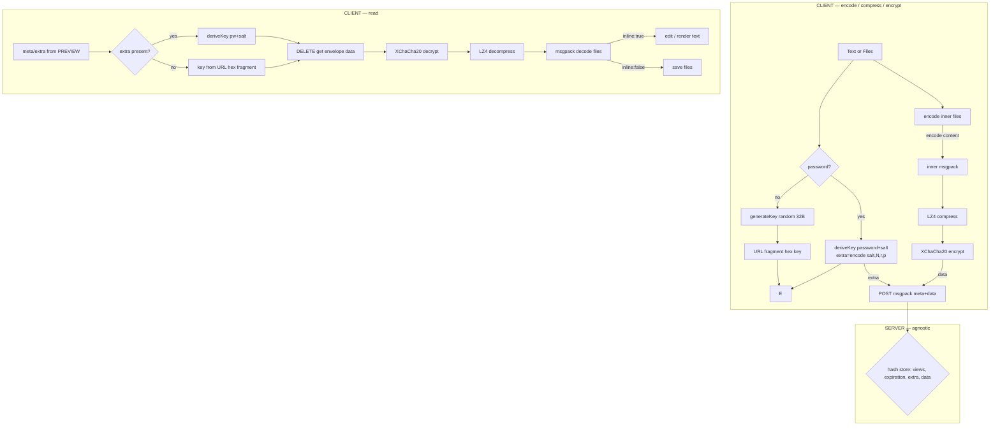

# Roadmap

## Todo

- Localize i18n readmes: `README_ES.md`, `README_zh-CN.md` still reference `REDIS` / `/api/v1`-era endpoint names — align to `CACHE` / `/healthz` (also sweep `CONTRIBUTING.md`, `examples/*`, postman collection).
- Add remaining shared tooling to the pnpm catalog (`vite`, `tsdown`).
- Move formatting, linting and type-checking + git hooks onto `vite-plus` (oxlint, oxfmt, vitest).
- Re-add CSP (`Content-Security-Policy`) wired into the axum router (was in `csp.rs`, removed as unused).
- Move all CLI deps to `devDependencies` — they bundle into the single output file anyway.

## Unified payload (drop the text/file union)

> Follow-up iteration of the inner payload, parked as `v3.1` (not part of core v3).

Everything becomes a **file**. Text is just a `FileDTO` with `inline: true`. The `{ type: "text" } | { type: "files" }` union is removed.

```
# Inner layer (encrypted, client-only)
{ files: [
  { name: string, mime: string, size: number, data: bytes, inline?: boolean }
] }
```

- `FileDTO` gains `inline?: boolean` (default `false`).
- `inline: true` = the file was authored inline at compose time (e.g. an empty text file the user typed into). Purely a **client/UI hint** — rides inside the encrypted inner payload, the server never sees it.
- `inline: true` files render as an **editable text editor**; the rest render as binary file cards (upload/download).
- Default composer state = one empty `inline:true` text file the user edits. No `isFile` toggle.

### Impact by area

- **Server / wire protocol / `api.ts`**: unchanged. Still an opaque encrypted `data` blob in the outer msgpack envelope.
- **Shared codec**: `NoteContent` becomes `{ files: FileDTO[] }`; drop the union + `switch(type)` in `unpackContent`. `packContent(input: FileDTO[], password?)`. Breaking inner-msgpack schema → ok, pre-release.
- **Frontend (`Create.svelte` — biggest)**: one `files: FileDTO[]` model; default empty `inline` text file; editor binds a string, encodes to bytes on submit; add real files via upload (`inline:false`).
- **CLI**: `send text "x"` → `files:[{ name:'note.txt', mime:'text/plain', data:utf8, inline:true }]`. `send file a b` → drop `type` union. `open`/download prints text files, saves the rest.
- **Tests**: `payload.test.ts` rewritten to `{ files:[...] }`; playwright `switch-file`/`text-field` composer specs collapse + rework.

### Watches

- text↔bytes round-trip in the editor (encoding, line-endings);
- `size` must be set from the _encoded_ bytes (matches `SIZE_LIMIT` / preview) — recompute after text→bytes;
- pasted binary files keep `inline:false`; only inline-authored text is `inline:true`.

### Payload pipeline


